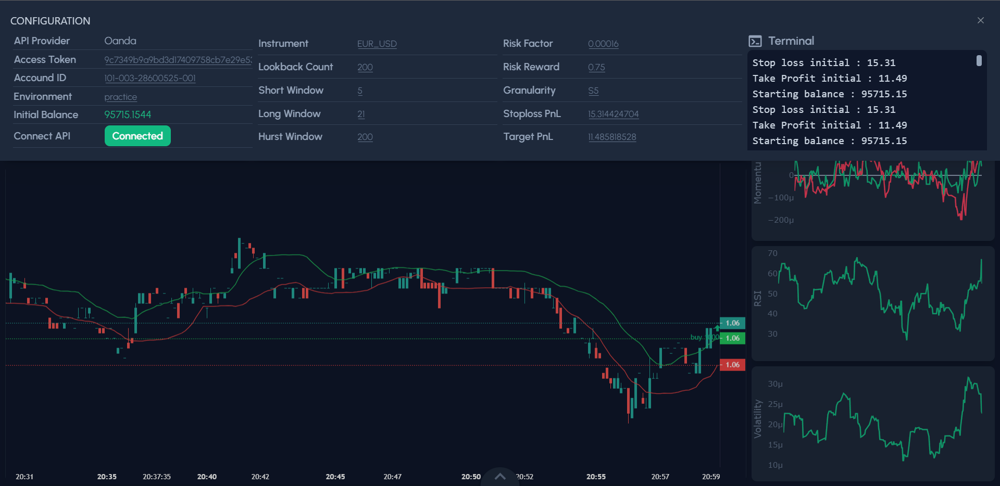

# Momentum_Hurst_RealTime

__Momentum_Hurst_RealTime__ is a Dash application for real-time FX trading using Oanda API & customized strategy (Momentum, Hurst & Bollinger Bands). It implements a dashboard for real-time trading. The __deprecated__ backtest dashboard is located in the `backtester` branch.

## Table of Contents

- [Momentum\_Hurst\_RealTime](#momentum_hurst_realtime)
  - [Table of Contents](#table-of-contents)
  - [Project Structure](#project-structure)
  - [Getting Started](#getting-started)
  - [Interface](#interface)
    - [Homepage](#homepage)
    - [Dashboard](#dashboard)
  - [Disclaimer](#disclaimer)

## Project Structure

Here's a high-level overview of the directory structure:

```plaintext
.
├── assets        # Contains static files like css and js files.
├── backtest      # Jupyter Notebook files for backtesting strategies.
├── components    # Components used in Dash app.
|   └── common        # Skeleton components used across components
├── configs       # Configuration files and constants for app & Oanda.
├── data          # Global data storage.
├── pages         # Pages to be switched for different URLs.
├── services      # Service modules for handling data retrieval & processing.
└── app.py        # The main entry point of the Dash application.
```

## Getting Started
Install all required packages:\
`pip install requirements.txt`\
Run local Dash server:\
`python app.py` or `python3 app.py`.\
Access the application via http://localhost:8050. You may customize server configurations under `./configs/server_conf.py`.

## Interface
### Homepage

### Dashboard

## Disclaimer

This project is created for educational purposes as part of the FT5010 group project at the National University of Singapore (NUS) and is not intended to provide investment advice.